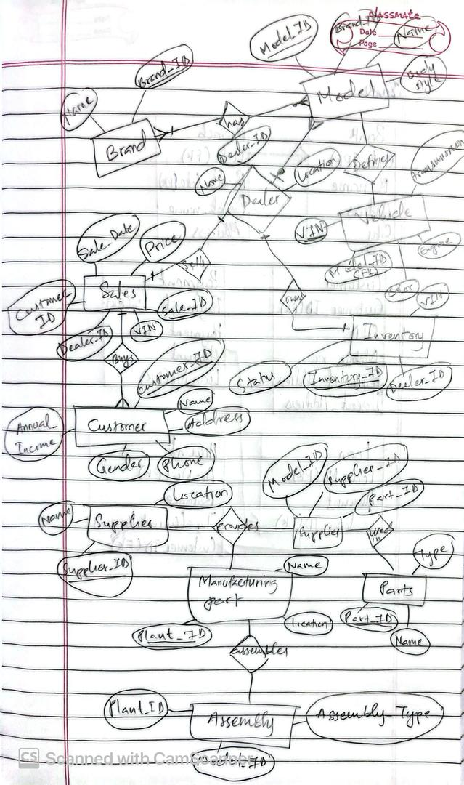

# Understanding Entity-Relationship Diagrams and Relational Schema Design
----

In the world of database design, structuring data effectively is crucial for building efficient and scalable systems. The foundation of this process lies in **Entity-Relationship Diagrams (ERD)** and their transformation into **Relational Schema**. Let's explore these concepts in detail.

## What is an Entity-Relationship Diagram (ERD)?
An ERD is a conceptual blueprint that visually represents the relationships between different data entities in a system. It is a critical step in database modeling, helping designers structure the data before implementation.

### Key Components of an ERD:
1. **Entities** – Represent real-world objects, such as Students, Courses, or Employees.
2. **Attributes** – Characteristics of entities, such as a Student’s Name, ID, or Date of Birth.
3. **Relationships** – Associations between entities, such as a Student *enrolling* in a Course.
4. **Primary Keys** – Unique identifiers for each entity, ensuring data integrity.
5. **Cardinalities** – Define the number of relationships between entities (e.g., One-to-One, One-to-Many, Many-to-Many).

## Relational Model and Schema Design
Once an ERD is established, the next step is to translate it into a relational schema. The **Relational Model** structures data into tables with rows (tuples) and columns (attributes).

### Steps to Convert ERD into a Relational Schema:
1. **Create Tables for Each Entity** – Convert each entity into a table, where attributes become columns.
2. **Define Primary and Foreign Keys** – Ensure each table has a primary key, and foreign keys establish relationships.
3. **Handle Multivalued and Composite Attributes** – Use separate tables for multivalued attributes and split composite attributes into individual columns.
4. **Map Relationships**:
   - **One-to-One**: Use foreign keys in one of the tables.
   - **One-to-Many**: Place the primary key of the “one” side as a foreign key in the “many” side.
   - **Many-to-Many**: Create an intermediary table with composite primary keys.
5. **Normalize Data** – Remove redundancy and ensure data consistency by following normalization rules.

## Examples for ER Diagram and Relational Schema:

### ER Diagram:

### Relational Schema:

## Relational Algebra: Foundation of Query Languages
Relational Algebra is a fundamental aspect of relational databases, providing the theoretical foundation for SQL and other query languages. It is a **functional query language** used to manipulate and retrieve data.

### Key Operations in Relational Algebra:
1. **Selection (σ)** – Filters tuples based on a given predicate. Example: σStudentNo='12345'(Student) retrieves the student with ID 12345.
2. **Projection (Π)** – Selects specific attributes from a relation. Example: ΠName, Programme_ID(Student) retrieves only names and program IDs.
3. **Union (∪)** – Combines tuples from two relations, removing duplicates.
4. **Intersection (∩)** – Retrieves only tuples present in both relations.
5. **Difference (-)** – Retrieves tuples that are in one relation but not in another.
6. **Cartesian Product (X)** – Combines every tuple from one relation with every tuple from another.
7. **Join (⋈)** – Combines relations based on a common attribute. Example: Instructor ⋈ InstructorID=TeachesID Teaches.

### Why Relational Algebra Matters
- It forms the basis of SQL query optimization.
- It helps in understanding how queries retrieve data efficiently.
- It ensures that databases follow a structured and logical approach to data manipulation.

## Key Takeaways from the Unit
- ERD is the foundation of structured database design, helping visualize relationships and attributes.
- The relational model organizes data into structured tables, ensuring efficiency and data integrity.
- Converting ERDs into schemas involves defining relationships, primary keys, and normalization.
- Understanding different types of relationships (one-to-one, one-to-many, many-to-many) is crucial in database modeling.
- Normalization minimizes data redundancy and enhances data consistency.
- Relational Algebra provides the theoretical framework for writing database queries.

## What I Learned and Why It Matters
This unit helped solidify my understanding of database design principles and best practices. Learning how to transition from conceptual diagrams to relational schemas is invaluable for creating scalable and efficient databases. Understanding **Relational Algebra** has deepened my knowledge of how queries work under the hood, enhancing my ability to optimize database performance.

## Personal Growth and Reflection
Working through this unit has been a significant learning experience. It has enhanced my problem-solving skills, particularly in structuring complex data relationships. I now feel more confident in designing relational databases, understanding **query languages**, and optimizing database queries. Additionally, this unit has reinforced the importance of proper planning before implementation, which is a skill applicable not just in database design but in software development as a whole.

## Conclusion
Understanding ERD and its translation into a relational schema is fundamental for database design. A well-structured relational schema ensures **data integrity, consistency, and efficiency**, paving the way for scalable and robust database systems. Additionally, mastering **Relational Algebra** equips developers with the tools to write efficient and optimized queries.

By mastering ERDs, relational schema design, and Relational Algebra, developers can build databases that accurately model real-world scenarios and optimize data storage and retrieval.