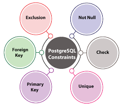
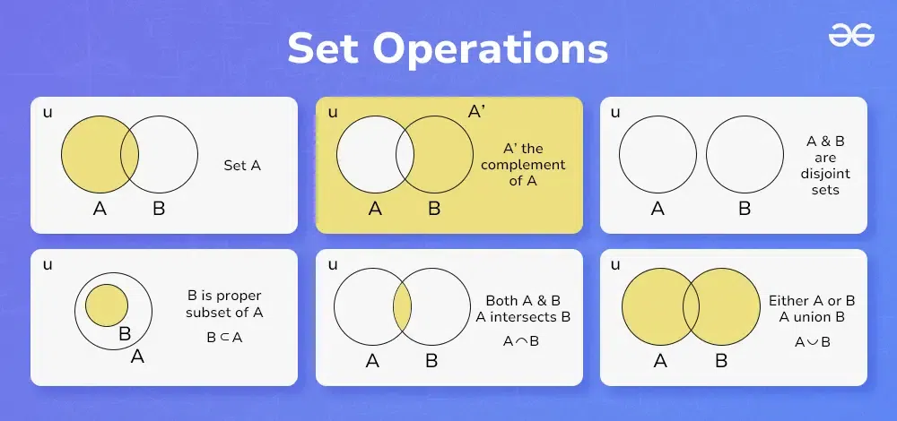
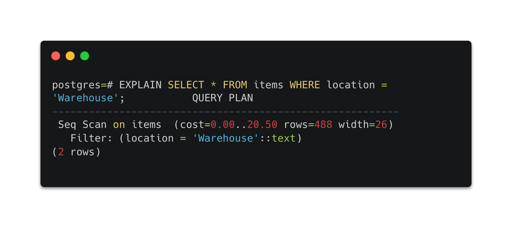

# **Advanced SQL Concepts and Database Management**  

## **Introduction**  
Over the past few lessons, I have deepened my understanding of database management, particularly in structuring, querying, and manipulating data in SQL. These lessons covered:  

- **Integrity Constraints and Triggers** 
- **Relational Algebra and Advanced Querying**
- **SQL – Null Values, Aggregates, and Nested Queries**

Each lesson built on the previous ones, helping me gain confidence in designing reliable and optimized databases.  

---  

# **Integrity Constraints and Triggers**  

One of the most crucial aspects of database management is ensuring **data integrity**. This lesson introduced **integrity constraints**, which help maintain accuracy and consistency in databases.  

### **Key Integrity Constraints**  
1. **Primary Key Constraint:** Ensures uniqueness in a table.  
   ```sql
   CREATE TABLE students (
      student_id INT PRIMARY KEY,
      name VARCHAR(50),
      age INT
   );
   ```
2. **Foreign Key Constraint:** Maintains referential integrity between tables.  
   ```sql
   CREATE TABLE enrollments (
      enrollment_id INT PRIMARY KEY,
      student_id INT,
      FOREIGN KEY (student_id) REFERENCES students(student_id)
   );
   ```
3. **CHECK Constraint:** Restricts column values based on conditions.  
   ```sql
   ALTER TABLE students ADD CHECK (age >= 18);
   ```
4. **NOT NULL Constraint:** Ensures a column cannot store null values.  
   ```sql
   CREATE TABLE courses (
      course_id INT PRIMARY KEY,
      course_name VARCHAR(100) NOT NULL
   );
   ```




### **Triggers: Automating Database Actions**  
Triggers automatically execute when a specific event occurs in a database.  

- **Example:** A trigger that prevents negative salaries.  
  ```sql
  CREATE TRIGGER salary_check
  BEFORE INSERT ON employees
  FOR EACH ROW
  BEGIN
     IF NEW.salary < 0 THEN
        SIGNAL SQLSTATE '45000' SET MESSAGE_TEXT = 'Salary cannot be negative';
     END IF;
  END;
  ```


---  

# **Relational Algebra and Advanced Querying**  

Understanding **relational algebra** helped me see how queries are processed at a deeper level. This formal foundation helps optimize SQL queries for better performance.  

### **Basic Relational Algebra Operations**  
- **Selection (σ):** Filters rows based on conditions.  
- **Projection (π):** Selects specific columns.  
- **Join (⨝):** Combines data from multiple tables.  
- **Union (∪) and Intersection (∩):** Merge or find common data between sets.  
- **Difference (-):** Returns data present in one table but not another.  


 

### **Complex Query Optimization**  
Applying relational algebra concepts helped me improve query performance using techniques such as:  

- **Indexing** for faster lookups.  
- **Query restructuring** to reduce redundant operations.  
- **Using `EXPLAIN`** to analyze query execution plans.  


 

---  

# **SQL - Null Values, Aggregates, and Nested Queries**  

Building on the previous lessons, I explored how to handle **null values**, work with **aggregate functions**, and write **nested queries**.  

### **Handling Null Values**  
Null values represent missing or unknown data. I learned that:  
- Using `IS NULL` helps identify missing values.  
- Aggregate functions like `AVG()` ignore nulls.  


### **Aggregate Functions and Grouping Data**  
SQL’s aggregate functions helped me summarize large datasets:  
```sql
SELECT department, AVG(salary)
FROM employees
GROUP BY department;
```
I also used `HAVING` to filter groups after applying `GROUP BY`:  
```sql
SELECT deptname, AVG(salary) AS avgSalary
FROM instructor
GROUP BY deptname
HAVING AVG(salary) > 42000;
```
 

### **Nested Queries and Window Functions**  
I explored **nested subqueries** for filtering and ranking data.  
```sql
SELECT name FROM students
WHERE student_id IN (
   SELECT student_id FROM enrollments WHERE course = 'Database Systems'
);
```
I also learned about **window functions**, which perform calculations across subsets of rows without grouping them.  
```sql
SELECT name, department, salary,
RANK() OVER (PARTITION BY department ORDER BY salary DESC) AS rank
FROM employees;
```

---  

# **Key Takeaways**  
- **Integrity constraints and triggers ensure data reliability and automate database management.** 
- **Relational algebra provides a formal foundation for understanding and optimizing SQL queries.**
- **Handling null values, using aggregate functions, and writing nested queries improve data retrieval efficiency.**

---  

# **What I Learned and Why It Matters**  
Mastering these concepts has strengthened my ability to design, query, and optimize databases effectively. Understanding how constraints maintain **data integrity**, how relational algebra improves **query performance**, and how advanced SQL techniques enable **efficient data analysis** will be invaluable in any database-driven application.  

---  

# **Personal Growth and Reflection**  
These lessons have significantly improved my SQL skills. Initially, I struggled with understanding **triggers and query optimization**, but practicing these concepts helped me gain confidence. The ability to write **efficient, well-structured queries** is an essential skill, and I can now approach real-world database problems with a more systematic mindset.  

This journey has reinforced the importance of **structured thinking** and **performance optimization** in database management, making me more prepared for complex database tasks.  

---