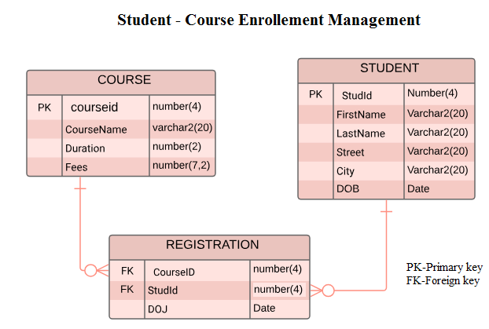
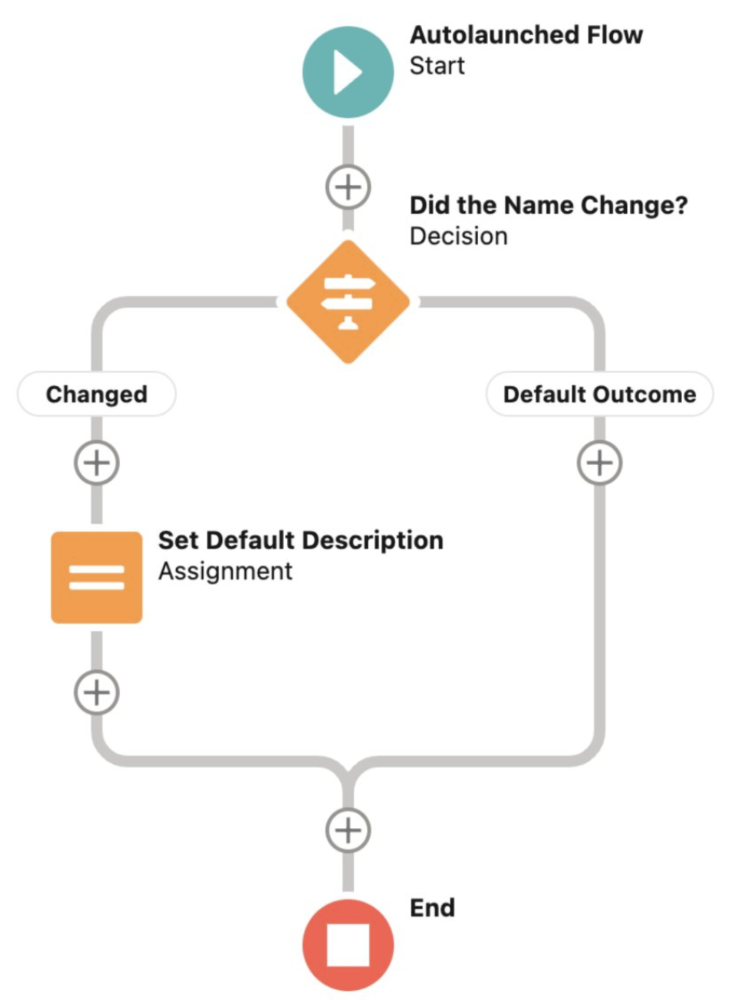
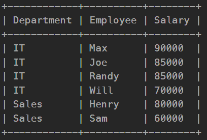

# **Advanced SQL Concepts – Joins, Views, Indexes, Functions, Triggers & Recursion** 

---

## Introduction

Over the past few weeks, we've ventured into the more advanced layers of SQL. Lessons 9 through 12 covered a broad range of topics, from joins and views to stored procedures, triggers, recursive queries, and powerful aggregation techniques. These concepts have transformed the way I understand databases—no longer just static repositories, but dynamic, rule-driven systems capable of complex logic and automation.

---

## Key Takeaways

### 1. SQL Joins: Making Data Work Together

Understanding how different join types affect query results was one of my earliest wins. I can now confidently choose between:

- `INNER JOIN` for exact matches
- `LEFT/RIGHT JOIN` for partial data inclusion
- `FULL OUTER JOIN` for a comprehensive view


---

### 2. Views and Materialized Views

Views simplify query writing and improve data security. I also learned about **materialized views**, which store data to speed up queries.

```sql
CREATE VIEW swefaculty AS
SELECT ID, name, deptname
FROM instructor
WHERE deptname = 'swe';
```

---

### 3. Enforcing Data Integrity with Constraints

Using SQL constraints like `PRIMARY KEY`, `FOREIGN KEY`, and `CHECK`, I can enforce rules at the database level—ensuring reliable and consistent data.

```sql
ALTER TABLE students ADD CHECK (age >= 18);
```



---

### 4. Speeding Up Queries with Indexes

I saw firsthand how `CREATE INDEX` helps in retrieving data quickly, especially when filtering or joining large datasets.

---

### 5. Functions and Procedures: Building Business Logic

Functions return values; procedures execute workflows. I practiced creating appointment schedulers and custom data retrievers using `plpgsql`.

```sql
CALL schedule_appointment(3, 2, '2024-04-10', '14:30:00', 'Check-up');
```

---

### 6. Triggers: Automating Actions

Triggers execute based on database changes. For example, I created a trigger that alerts users when a negative salary is entered—automating error handling and enforcing rules.



---

### 7. Recursive Queries: Navigating Hierarchies

In Lesson 12, we explored **recursive Common Table Expressions (CTEs)**. These let us query hierarchical data (like employee-manager chains or organizational structures) in SQL.

```sql
WITH RECURSIVE R(n) AS (
   SELECT 1
   UNION ALL
   SELECT n + 1 FROM R WHERE n < 5
)
SELECT * FROM R;
```

---

### 8. Advanced Aggregation

We used window functions like `RANK()` and `DENSE_RANK()` to perform analytics across subsets of rows without grouping them.

```sql
SELECT name, department, salary,
RANK() OVER (PARTITION BY department ORDER BY salary DESC) AS rank
FROM employees;
```



---

## What I Learned and Why It Matters

Each lesson added a layer to my SQL skillset:

- Joins and views help me manage and present data better.
- Indexes and constraints ensure performance and reliability.
- Stored functions, procedures, and triggers let me automate and enforce logic.
- Recursive queries and window functions introduced ways to handle **complex analytical tasks** that I didn’t know were possible within SQL itself.

These are the kinds of skills that bridge the gap between academic learning and real-world application.

---

## Personal Growth and Reflection

Initially, I was nervous about working with **triggers** and **recursive queries**. They felt abstract and intimidating. But through practice and examples, I’ve come to appreciate their elegance and power.

The deeper I go into SQL, the more I realize it's not just about getting data—it's about **designing systems that are smart, fast, and secure**.

This unit helped me think more like a backend developer—planning how data flows, how logic is enforced, and how systems should behave under different scenarios.

---

## Visual Suggestions Summary

| Section              | Suggested Visual                              |
|----------------------|-----------------------------------------------|
| SQL Joins            | Venn Diagrams                                 |
| Views                | Logical vs. Materialized Views Diagram        |
| Constraints          | ERD with constraints                          |
| Indexes              | Speed comparison bar graph                    |
| Functions & Procedures | Flowchart showing execution differences    |
| Triggers             | Sequence diagram of trigger firing            |
| Recursive Queries    | Tree diagram showing recursive steps          |
| Window Functions     | Table output with rankings                    |

