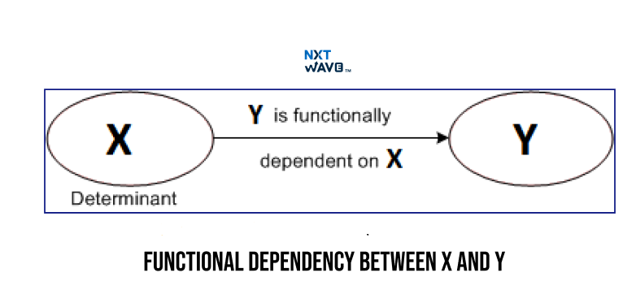

# Reflective Blog Entry – Lessons 12–13  
**Unit Title:** Advanced Relational Database Design and Temporal Data Management  
**Date:** April 22, 2025  

---

## Introduction

Lessons 12 and 13 introduced me to deeper principles of database design, including normalization, multivalued dependencies, functional dependency theory, and modeling temporal data. These concepts are vital for creating efficient, reliable, and future-proof databases. Through decomposition techniques and normalization theory, I learned how to optimize schemas and better manage complex data relationships over time.

---

## Key Takeaways

### 1. Features of Good Relational Designs

A well-designed relational schema should:

- Represent entities clearly without mixing attributes.
- Minimize NULL values.
- Avoid spurious tuples by ensuring **lossless joins**.
- Eliminate redundancy.
- Prevent modification anomalies.

---

### 2. Decomposition and Normalization

We explored how to break schemas into smaller relations to eliminate redundancy and anomalies while ensuring no loss of information.

- **Lossless Decomposition** ensures original data can be recovered.
- **Functional Dependencies** are used to guide decomposition.

---

### 3. Normal Forms

Normalization reduces redundancy and organizes data effectively:

- **1NF**: No multi-valued attributes.
- **2NF**: No partial dependency on primary key.
- **3NF**: No transitive dependency.
- **BCNF**: Every determinant is a candidate key.
- **4NF and 5NF**: Handle multivalued and join dependencies.

---

### 4. Functional Dependency Theory

I learned to use **Armstrong's Axioms** (Reflexivity, Augmentation, Transitivity) to reason about dependencies, and how to compute **canonical covers** for minimal functional dependency sets.



---

### 5. Multivalued Dependencies and 4NF

Even BCNF cannot eliminate all redundancies. **Multivalued Dependencies** (MVDs) occur when two attributes are independent of each other. To fully remove these redundancies, we use **Fourth Normal Form (4NF)**.

---

### 6. Higher Normal Forms: 5NF and DKNF

- **5NF/PJNF** deals with more complex join dependencies.
- **DKNF** is based on domain and key constraints.

These forms are complex and rarely used in practice, but understanding them gave me a deeper insight into database theory.

---

### 7. Atomic Domains and 1NF

Every attribute must be atomic (indivisible) to satisfy 1NF. Composite and multivalued attributes should be separated.

---

### 8. Database Design Process

Effective design starts with:
- Good **E-R modeling**.
- Normalization to remove anomalies.
- Following **naming conventions** and **unique role assumptions**.

Sometimes intentional **denormalization** is used to optimize query performance, with careful trade-offs.

---

### 9. Modeling Temporal Data

Temporal data records values valid over time intervals. Managing temporal data introduces:
- Temporal functional dependencies.
- New constraints for primary and foreign keys.
- Complexities like non-overlapping time intervals.

Example:
```sql
course(course_id, title, dept_name, credits, start_date, end_date)
```

SQL:2011 introduced partial support for temporal features like PERIOD FOR clauses.

---

## What I Learned and Why It Matters

These lessons have sharpened my ability to:

- **Design robust databases** that maintain consistency and minimize redundancy.
- **Decompose schemas** systematically using functional dependencies.
- **Understand temporal complexities** in databases and manage evolving information correctly.

These skills are crucial in building large-scale, reliable applications, from hospital systems to e-commerce platforms.

---

## Personal Growth and Reflection

Initially, concepts like multivalued dependencies, canonical covers, and temporal modeling felt abstract. However, working through real-world examples made them relatable. I feel more confident now in analyzing database designs critically and recognizing the trade-offs between **normalization** and **performance**.

Moreover, learning how to model **time-dependent data** has prepared me for future projects that involve changing data over periods—something extremely common in the real world.

This journey emphasized the importance of **structure, precision, and foresight** in database design.

---

## Visual Suggestions Summary

| Section                         | Suggested Visual                                 |
|---------------------------------|--------------------------------------------------|
| Good Relational Designs         | Diagram showing anomalies                       |
| Decomposition                   | Step-by-step decomposition flowchart           |
| Normal Forms                    | Table comparing 1NF to 5NF                      |
| Functional Dependencies         | Armstrong's Axioms diagram                      |
| Multivalued Dependencies        | 4NF decomposition example                      |
| Atomic Domains                  | Before and after atomic domain adjustment       |
| Temporal Data                   | Timeline showing temporal data modeling        |

